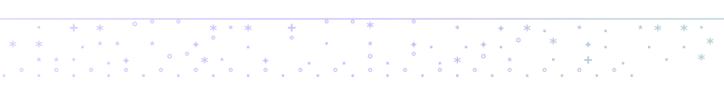

<p align="center">
  
</p>

<!-- add signature.svg to ./assets/ -->

<h1 align="center">bird-skill</h1>

<p align="center">claude code skill for bird, the twitter/x cli. originally by <a href="https://x.com/steipete">@steipete</a>.</p>

<p align="center">
  
  
  
</p>

<p align="center">
  <a href="#what-it-does">what it does</a> · <a href="#install">install</a> · <a href="#usage">usage</a> · <a href="#changelog">changelog</a>
</p>

<br>
<br>

<p align="center">
  
</p>

<br>
<br>

## what it does

[bird](https://github.com/steipete/bird) is a fast cli for twitter/x, built by [@steipete](https://x.com/steipete). reads tweets, searches, posts, follows, checks your timeline. all from the terminal using your browser's saved cookies — no api keys, no oauth dance.

the original repo was removed from github. we keep it accessible at [zaydiscold/bird](https://github.com/zaydiscold/bird).

this is a claude code skill that wraps it. paste an x.com link into any conversation and your agent reads it directly. no browser tab, no webfetch, no auth setup. the skill is bash-only by design (`allowed-tools: Bash`) — that's the whole point: agents read twitter without opening a browser.

open tools should stay open.

works in claude code, codex, cursor, openclaw, gemini. one install, all agents.

<br>
<br>

<p align="center">
  
</p>

<br>
<br>

## install

**step 1:** install the bird cli

```bash
brew install steipete/tap/bird  # via homebrew tap (try this first)
```

if the tap is unavailable, install directly from the mirror:

```bash
# from zaydiscold/bird — universal arm64/x86_64 binary
curl -L https://github.com/zaydiscold/bird/releases/download/v0.8.0/bird -o bird
chmod +x bird
sudo mv bird /usr/local/bin/bird
```

verify it's working:

```bash
bird whoami  # should return your twitter handle
```

bird uses safari or chrome cookies automatically. no api keys, no oauth dance.

for full cli docs and archive: [zaydiscold/bird](https://github.com/zaydiscold/bird)

**step 2:** install the skill

```bash
npx skills add zaydiscold/bird-skill@bird -g -y  # global, all agents
```

or install to a single agent:

```bash
npx skills add zaydiscold/bird-skill@bird -y  # current project only
```

<br>
<br>

<p align="center">
  
</p>

<br>
<br>

## usage

once installed, the skill activates automatically. paste any x.com or twitter.com link and your agent reads it. no slash command needed.

```bash
# what the agent runs behind the scenes
bird read https://x.com/user/status/123456789   # single tweet
bird thread https://x.com/user/status/123456789  # full thread
bird search "query" -n 20                         # search tweets
bird mentions -n 20                               # your mentions
bird home -n 20                                   # for you feed
bird home --following -n 20                       # chronological
bird news --ai-only                               # trending topics
bird user-tweets @handle -n 20                    # someone's profile
```

posting requires a confirm from you first. reading is automatic.

```bash
bird tweet "text here"              # post a tweet
bird reply <url-or-id> "reply"      # reply to a tweet
bird follow @handle
bird bookmarks -n 20
bird likes -n 20
```

output options:

```bash
bird read <id> --json        # structured json
bird search "q" --plain      # no color, pipeable
```

<sub>all bird commands: read, thread, replies, search, mentions, home, bookmarks, likes, user-tweets, news, lists, list-timeline, following, followers, about, tweet, reply, follow, unfollow, unbookmark, whoami, check</sub>

<br>
<br>

<p align="center">
  
</p>

<br>
<br>

## changelog

### v1.0.2
- skill now detects missing bird binary on invocation and offers to install from [zaydiscold/bird](https://github.com/zaydiscold/bird/releases)
- install section updated with curl fallback for when steipete's brew tap is unavailable

### v1.0.1
- updated description: x.com/twitter.com URL trigger is now first (stronger auto-invoke)
- added `bird v0.8.0` badge
- credits @steipete as original bird author
- auth line now shows `@ColdCooks` for clarity
- bash-only design note (no browser, no webfetch — that's the point)
- links to [zaydiscold/bird](https://github.com/zaydiscold/bird) for cli docs and archive

### v1.0.0
- initial release: read, search, thread, post, timeline
- cross-agent: claude code, codex, cursor, openclaw, gemini
- follows agentskills open standard

<br>
<br>

<p align="center">
  <a href="https://star-history.com/#zaydiscold/bird-skill&Date">
    <picture>
      <source media="(prefers-color-scheme: dark)" srcset="https://api.star-history.com/svg?repos=zaydiscold/bird-skill&type=Date&theme=dark" />
      <source media="(prefers-color-scheme: light)" srcset="https://api.star-history.com/svg?repos=zaydiscold/bird-skill&type=Date" />
      
    </picture>
  </a>
</p>

<p align="center">mit. <a href="./LICENSE">license</a></p>

<br>
<br>

<p align="center">
  
</p>

<br>
<br>

<p align="left"><strong>zayd / cold</strong></p>

<p align="center">
  <a href="https://zayd.wtf">zayd.wtf</a> · <a href="https://x.com/coldcooks">twitter</a> · <a href="https://github.com/zaydiscold">github</a>
  <br>
  <em>icarus only fell because he flew</em>
</p>

<p align="right">
  <strong>to do</strong><br>
  <sub>
  ☑ core skill: read, search, thread, post, timeline<br>
  ☑ cross-agent: claude code, codex, cursor, openclaw, gemini<br>
  ☑ follows agentskills open standard<br>
  ☑ auto-install bird if missing<br>
  ☐ skills.sh listing<br>
  ☐ firefox profile support in skill<br>
  ☐ multi-account switching
  </sub>
</p>

<br>
<br>
<br>
<br>

<p align="center">
  
</p>
